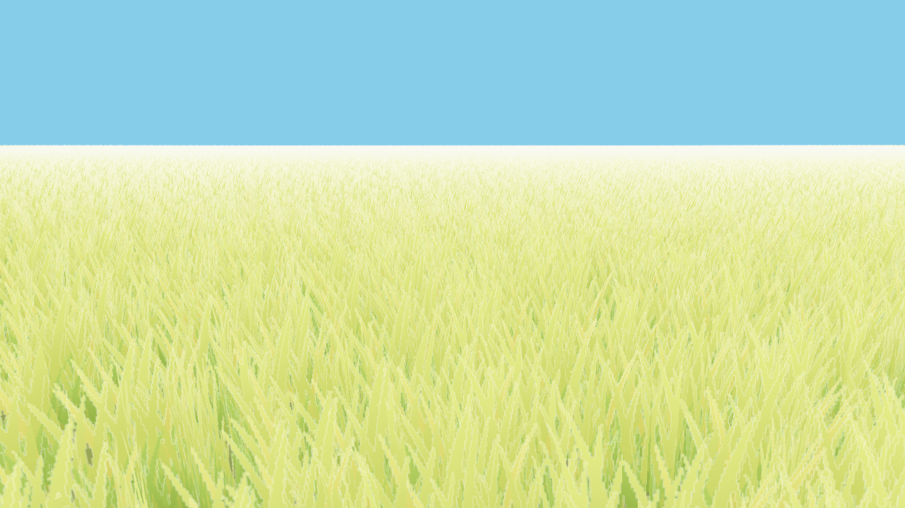

# grass

Grass implementation using moderngl in Python.
This follows the tutorial by Acerola in YouTube:

https://www.youtube.com/watch?v=Y0Ko0kvwfgA

The implementation uses 3 planes with an alpha texture per grass instance, and
instanced rendering to render around 4M triangles.

## Usage

Install all dependencies with: `$ pip install -r requirements.txt`

Run `$ python main.py`

